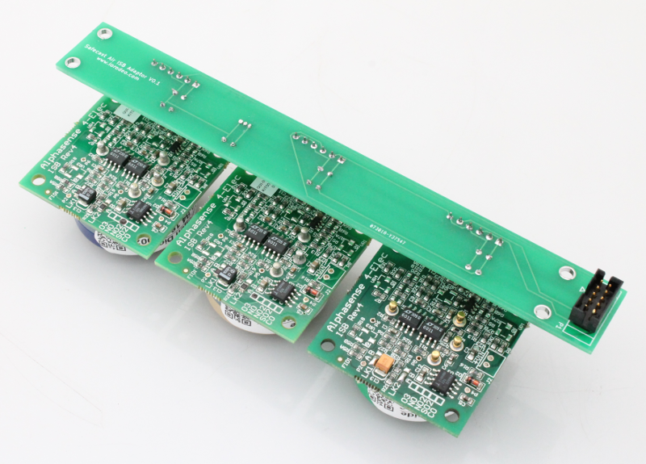

Alphasense Individual Sensor Boards (B4)
============================================

.. figure:: _static/alphasense_gas_2.png
   :align:  center

|

* These are the larger B4 size (32mm) Individual Sensor Board (ISB) from Alphasense
* Like the smaller A4 type, these are also available for measuring several gases including carbon monoxide, ozone, nitric oxide and more
* More information on the A4 air quality sensors can be found on the Alphasense website: http://www.alphasense.com/index.php/air/products/

Safecast ISB Adaptor Board
-------------------------------------------

* Use the Safecast ISB Adaptor Board to connect up to 3 of the B4 sensors to the Safecast Air board
* ISB Adaptor Board also includes a temperature sensor

.. figure:: _static/isb_front.png
   :align:  center

ISB Adaptor Board BOM
^^^^^^^^^^^^^^^^^^^^^^^^^^^

=============  =====  =============================================   ===================     =======================         
Ref            Qty    Description                                     Vendor                  Part #
=============  =====  =============================================   ===================     =======================         
P1              1      Mini shrouded header, 5x2                       Digikey                 S68KCACT-ND
P2,3,4          1      Breakaway header, female, 36 pos                Digikey                 929974E-01-36-ND
C1,3,5          3      10 nF                                           Digikey                 399-9858-1-ND
C2,4,6,7        4      100 nF                                          Digikey                 399-4151-ND
U1              1      Temperature Sensor                              Digikey                 TMP36GT9Z-ND
=============  =====  =============================================   ===================     =======================         
 
Connecting to the Safecast Air Board
------------------------------------------
 
* Mount up to 3 of the sensors to the Safecast ISB Adaptor Board
 
.. figure:: _static/isb_3.png
   :align:  center

|

* The Safecast Air Board includes two designated headers (P1 and P2) for the Alphasense air sensors. 
* Using the same connector ribbon cable as described on the previous page, connect the ribbon cable to the back of the ISB Adaptor board and the P1 and/or P2 header on the Safecast Air Board.

.. figure:: _static/isb_5.png
   :align:  center

.. figure:: _static/isb_6.png
   :align:  center
