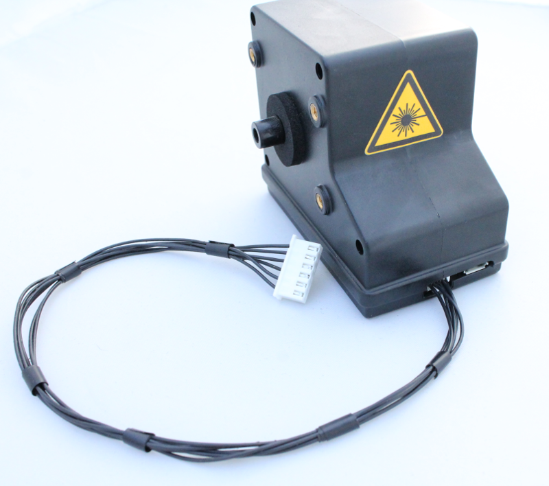

Alphasense Particulate Monitor (OPC-N2)
==========================================

.. figure:: _static/opc_n2_1.png
   :align:  center

|

* The Optical Particle Monitor (OPC-N2) measure PM1, PM2.5 and PM10. 
* More information on the Particulate Sensor can be found on the Alphasense website: http://www.alphasense.com/index.php/products/optical-particle-counter/

OPC-N2 Custom cable
----------------------------------------

Make a custom cable for connecting the Particulate monitor to the board

=====  =============================================   ===================     =======================         
Qty    Description                                     Vendor                  Part #
=====  =============================================   ===================     =======================         
1      Wire, 28 AWG, Black                              Digikey                 W2628B-50-ND
1      Connector recept, 6 pos, 1 mm                    Digikey                 WM7919-ND
6      Terminal crimp for use with 1mm connector        Digikey                 WM7933-ND
1      Connector recept, 6 pos, 2.5 mm                  Digikey                 455-2218-ND
6      Terminal crimp for use with 2.5 mm connector     Digikey                 455-2261-1-ND
=====  =============================================   ===================     =======================         

Other tools you will need to make the cable: hand crimp e.g. Molex hand crimp.

.. figure:: _static/opc_cable_3.png
   :align:  center

Connecting to the board
----------------------------

* The Safecast Air Board has a designated header (P9) for the OPC-N2 particulate monitor. 
* Connect the OPC-N2 custom cable to the front of the OPC-N2 monitor and the P9 header on the Safecast Air Board.

.. figure:: _static/opc_cable_5.png
   :align:  center

