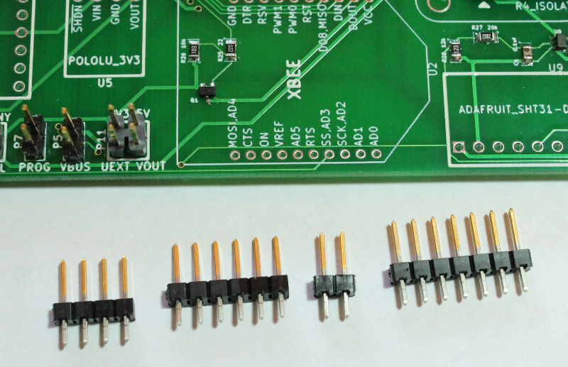

Solder Pin Headers
===================================

* Take the same breakaway header from the previous step and break off a 4-pin, 6-pin header, 2-pin and 7-pin header. 

  
|

* Solder the 6-pin and 4-pin into positions U4 and U5 as shown in the image below. **Solder with the shorter pin side facing up.** These pin headers will be used to connect the OpenLog SD card data logger and Pololu 3V3 optional power regulator later in the instructions. 

.. figure:: _static/v4_6b.png
   :align:  center
   
|
   
* Solder the 7-pin header into position U9 as shown in the image below. **Solder with the shorter pin side facing up.** This pin header will be used to connect the Adafruit temp/humidity sensor later in the instructions.
* Solder the 2-pin header into position P10. For this header, **solder with the longer pin side facing up.** This pin header can be used with a jumper to change the I2C address of the Adafruit temp/humidity sensor in the event of a conflict with an optional device on the UEXT header. 

.. figure:: _static/v4_6c.png
   :align:  center
   
   