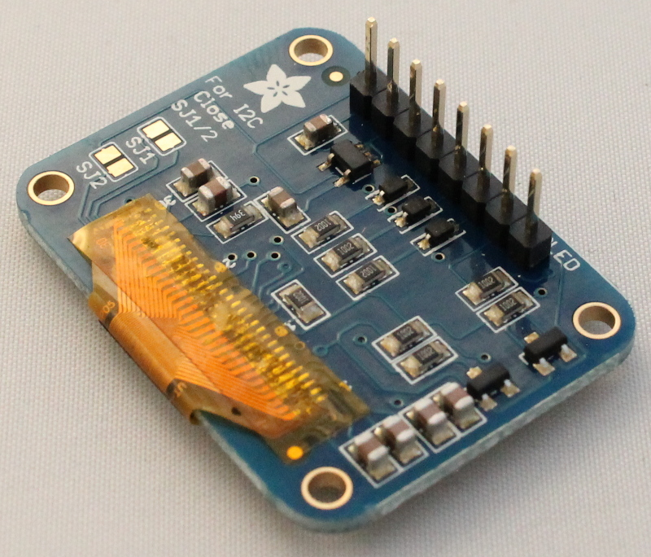

Placing GPS, XBEE and display
=============================================

In this step, place the following three components into the female headers which were placed earlier. These components are not soldered, as the pins on the components are instead pushed into the headers.  

Adafruit Ultimate GPS Breakout
^^^^^^^^^^^^^^^^^^^^^^^^^^^^^^^^^^^^

Adafruit GPS Breakout board comes with a 9-pin array. Solder this onto the breakout board as shown in the images below.
   
.. figure:: _static/22a_b.JPG
   :align:  center

Insert the GPS board into the 9-position female header as shown in the image below.

.. figure:: _static/v4_9d.png
   :align:  center
   
   
   
XBEE/WiFly wireless communication module
^^^^^^^^^^^^^^^^^^^^^^^^^^^^^^^^^^^^^^^^^^^^^

Insert the XBEE RF module or Sparkfun RN-XV WiFly into the sockets as shown in the image below. 
   
.. figure:: _static/v4_9e.png
   :align:  center

   
   
  
Adafruit OLED graphic display
^^^^^^^^^^^^^^^^^^^^^^^^^^^^^^^^^^^^

The Adafruit graphic display comes with an 8-pin array. Solder this onto the board as shown in the image below and insert the LCD display into the 8-position female header.

   
.. figure:: _static/v4_9f.png
   :align:  center
