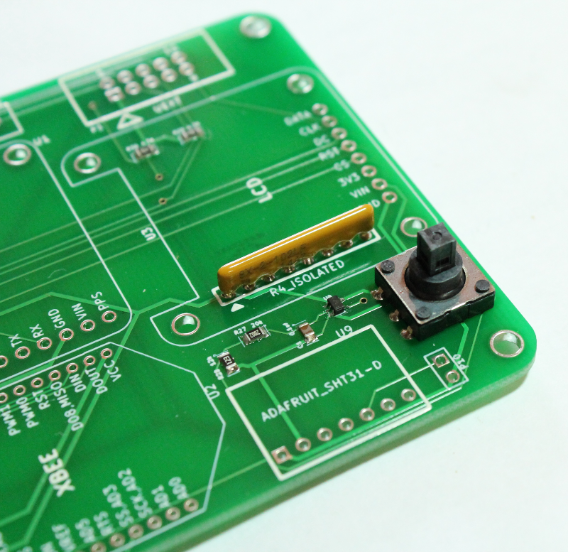

Joystick input circuit
===================================

A 5-position joystick toggle switch is used for accessing device configuration menus. It is not yet enabled in firmware. 
A resistor array (U7) is also required. 

* Solder the toggle switch and resistor array onto the board as shown in the pictures below. 

.. figure:: _static/v4_2a.png
   :align:  center

   
