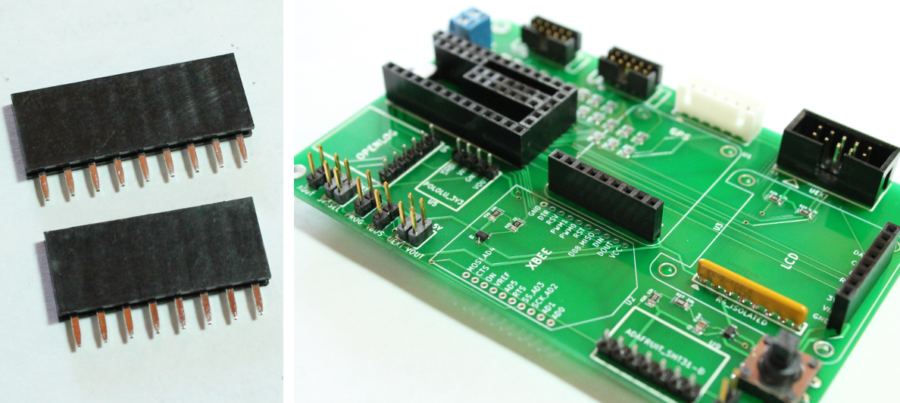

GPS, LCD and XBEE Headers
==================================

This step also involves soldering the same type of female headers onto the board. 

* Solder a 9-pos feamle header into U1 
* Solder a 8-pos feamle header into U3 
* These female headers will be used to connect the Adafruit Ultimate GPS Breakout, Adafruit OLED graphic display later in the instructions. 

   
|   

* Take the two 10-position XBEE headers. These are shorter headers than the ones used in the previous steps. 
* Solder these into the board at position U2 
* These female headers will be used to connect the XBEE RF module or Sparkfun RN-XV WiFly later in the instructions. 

.. figure:: _static/v4_8d_e.png
   :align:  center

